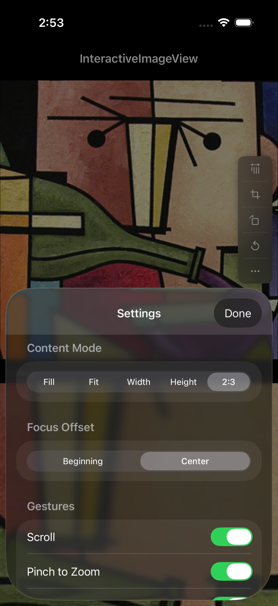

<p align="center">
    
</p>

<p align="center">
    
    <a href="https://cocoapods.org/pods/InteractiveImageView">
        
    </a>
    <a href="https://github.com/Carthage/Carthage">
        
    </a>
    <a href="https://swift.org/package-manager">
        
    </a>
</p>

A lightweight library for interactive image viewing — scroll, zoom, pinch, rotate, and crop — all inside a single `UIView`. Supports multiple content modes including custom aspect ratios (e.g. 2:3, 9:16). Works with both UIKit and SwiftUI.

## Features

- Crop image at current visible position
- Switch between content modes: aspect fill, aspect fit, width fill, height fill, or custom ratio
- Scroll on both axes
- Double-tap to zoom in/out with configurable zoom factor
- Pinch to zoom
- Rotate image by any degree
- Delegate callbacks for crop, scroll, zoom, and failure events
- All delegate methods are optional

### Preview
<p align="left">
    
</p>

## UIKit Usage

### Setup

1. Add a `UIView` and set its class to `InteractiveImageView`
2. Import `InteractiveImageView`
3. Configure and set the delegate

```swift
import InteractiveImageView

class ViewController: UIViewController, InteractiveImageViewDelegate {
    @IBOutlet weak var interactiveImageView: InteractiveImageView!

    override func viewDidLoad() {
        super.viewDidLoad()
        interactiveImageView.delegate = self

        if let image = UIImage(named: "photo") {
            interactiveImageView.configure(
                withNextContentMode: .heightFill,
                withFocusOffset: .center,
                withImage: image
            )
        }
    }

    func didCropImage(image: UIImage, fromView: InteractiveImageView) {
        // Handle cropped image
    }
}
```

### Methods

```swift
// Configure with content mode, focus offset, and image
interactiveImageView.configure(
    withNextContentMode: .aspectFill,
    withFocusOffset: .center,
    withImage: image
)

// Crop visible area (async via delegate)
interactiveImageView.performCropImage()

// Crop and get image synchronously
let cropped = interactiveImageView.cropAndGetImage()

// Get the original unmodified image
let original = interactiveImageView.getOriginalImage()

// Update image without reconfiguring
interactiveImageView.updateImageOnly(newImage)

// Toggle between content modes
interactiveImageView.toggleImageContentMode()

// Rotate image
interactiveImageView.rotateImage(90, keepChanges: true)
```

### Gesture Configuration

```swift
interactiveImageView.isScrollEnabled = true
interactiveImageView.isPinchAllowed = true
interactiveImageView.isDoubleTapToZoomAllowed = true
interactiveImageView.doubleTapZoomFactor = 2.0
```

### Delegate

All delegate methods are optional.

```swift
protocol InteractiveImageViewDelegate: AnyObject {
    func didCropImage(image: UIImage, fromView: InteractiveImageView)
    func didScrollAt(offset: CGPoint, scale: CGFloat, fromView: InteractiveImageView)
    func didZoomAt(offset: CGPoint, scale: CGFloat, fromView: InteractiveImageView)
    func didFail(_ fail: IIVFailType)
}
```

### Content Modes

```swift
enum IIVContentMode {
    case aspectFill       // 1:1 square fill
    case aspectFit        // Fit within bounds
    case widthFill        // Fill width, scroll vertically
    case heightFill       // Fill height, scroll horizontally
    case customOffset(offset: CGFloat)  // Custom ratio (e.g. 2.0/3.0)
}
```

## SwiftUI Usage

Wrap `InteractiveImageView` in a `UIViewRepresentable`. Use a bridge class for imperative actions.

```swift
import SwiftUI
import InteractiveImageView

// Bridge for imperative SDK calls
final class ImageViewActions {
    fileprivate weak var view: InteractiveImageView?

    func crop() { view?.performCropImage() }
    func toggleContentMode() { view?.toggleImageContentMode() }
    func rotate(degrees: CGFloat) { view?.rotateImage(degrees, keepChanges: true) }
}

struct InteractiveImageViewWrapper: UIViewRepresentable {
    let image: UIImage?
    let contentMode: IIVContentMode
    let actions: ImageViewActions
    var onCrop: (UIImage) -> Void = { _ in }

    func makeUIView(context: Context) -> InteractiveImageView {
        let view = InteractiveImageView(frame: .zero)
        view.delegate = context.coordinator
        actions.view = view
        view.configure(
            withNextContentMode: contentMode,
            withFocusOffset: .center,
            withImage: image
        )
        return view
    }

    func updateUIView(_ uiView: InteractiveImageView, context: Context) {
        context.coordinator.onCrop = onCrop
    }

    func makeCoordinator() -> Coordinator {
        Coordinator(onCrop: onCrop)
    }

    final class Coordinator: NSObject, InteractiveImageViewDelegate {
        var onCrop: (UIImage) -> Void

        init(onCrop: @escaping (UIImage) -> Void) {
            self.onCrop = onCrop
        }

        func didCropImage(image: UIImage, fromView: InteractiveImageView) {
            onCrop(image)
        }
    }
}
```

Then use it in any SwiftUI view:

```swift
struct ContentView: View {
    private let actions = ImageViewActions()
    @State private var croppedImage: UIImage?

    var body: some View {
        VStack {
            InteractiveImageViewWrapper(
                image: UIImage(named: "photo"),
                contentMode: .aspectFill,
                actions: actions,
                onCrop: { croppedImage = $0 }
            )
            .frame(height: 400)

            HStack {
                Button("Crop") { actions.crop() }
                Button("Rotate") { actions.rotate(degrees: 90) }
                Button("Toggle") { actions.toggleContentMode() }
            }

            if let croppedImage {
                Image(uiImage: croppedImage)
                    .resizable()
                    .aspectRatio(contentMode: .fit)
                    .frame(height: 200)
            }
        }
    }
}
```

## Example Project

Run `InteractiveImageViewExample` for a full SwiftUI demo showcasing all SDK features.

## Installation

### Swift Package Manager

Add to your `Package.swift`:

```swift
dependencies: [
    .package(url: "https://github.com/egzonpllana/InteractiveImageView.git", from: "2.0.0")
]
```

Or in Xcode: File > Add Package Dependencies and enter:
```
https://github.com/egzonpllana/InteractiveImageView.git
```

### CocoaPods

```ruby
pod 'InteractiveImageView'
```

### Carthage

```ogdl
github "egzonpllana/InteractiveImageView"
```

## Why InteractiveImageView?

A window is just glass until someone opens it. InteractiveImageView turns a static `UIImageView` into a living surface — one that responds to touch, yields to gestures, and frames exactly what the user intends. Scroll, zoom, pinch, rotate, crop — all orchestrated inside a single `UIView`, no view controller ceremony required. Drop it into any layout, any aspect ratio, any composition, and let the image breathe.

## Questions or feedback?

Feel free to [open an issue](https://github.com/egzonpllana/InteractiveImageView/issues/new), or find me [@egzonpllana on LinkedIn](https://www.linkedin.com/in/egzon-pllana/).
